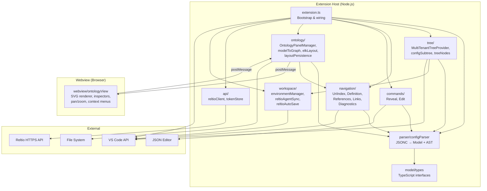

# Reltio Metadata Editor Architecture

> Audience: AI agents and human developers.

## Module Purpose

VS Code / Cursor extension for editing Reltio tenant metadata configurations (`*.reltio.json` files). Provides JSON schema validation, a hierarchical configuration tree view, Go-to-Definition / Find All References navigation, unresolved URI diagnostics, structural editing commands, and an interactive ontology graph preview.

This is a **single-module** project — not a multi-module monorepo. All source code lives under `src/` and is bundled into two separate artifacts: the extension host bundle and the webview client bundle.

## Domain Concepts

| Term | Definition |
|------|-----------|
| Reltio Business Model | The top-level JSON structure describing a Reltio tenant configuration — entity types, relation types, match rules, survivorship rules, cleanse rules, and related metadata. |
| Entity Type | A category of real-world object (e.g., Individual, Organization, Location) with attributes, match rules, and survivorship rules. |
| Relation Type | A named relationship between two entity types (e.g., "EmployedBy" linking Individual to Organization), with start/end type URIs. |
| Attribute | A data field on an entity or relation type. Can be simple (string, long, date), nested (contains sub-attributes), or reference (links to another entity type). |
| URI | A `configuration/...` path string that uniquely identifies a definition within the Reltio model (e.g., `configuration/entityTypes/Individual`). Used for cross-references throughout the JSON. |
| Consolidated Type | An entity type representing a merged "golden record" profile, as opposed to a source-specific profile. |
| Abstract Type | An entity type that serves as a parent for inheritance (`extendsFrom`) but is not instantiated directly. |
| UriIndex | The in-memory index mapping every `configuration/...` URI to its AST definition node and collecting all reference sites. Powers Go-to-Definition, Find References, diagnostics, and ontology navigation. |
| Virtual Definition | A synthetic URI created by `UriIndex` for attributes inherited through Reference attributes, allowing navigation to sub-attributes that are defined on a referenced entity type. |
| GraphModel | Intermediate data structure transforming the Reltio Business Model into nodes (entity types) and edges (inheritance, relationships, references) for ontology view rendering. |
| Layout Sidecar | A `*.reltio.layout.json` file stored alongside the configuration file, persisting user-arranged node positions for the ontology preview. |
| Environment | A Reltio host (e.g. `361.reltio.com`) represented as a `{host}.reltio.environment/` directory under `.reltio/` (preferred) or, for legacy workspaces, at the workspace root. Validated with `GET /reltio/status` before creation. |
| Tenant | A tenant ID under an environment, stored as `{tenantId}.reltio.tenant/` with optional `L3.reltio.json` (fetched L3 configuration) and optional `history/` (local configuration history snapshots). |
| Token Store | In-memory map of environment name → Bearer token (and optional aliases). Never persisted; cleared on restart. For browser-OAuth environments it additionally holds the refresh token and access-token expiry alongside the in-memory access token. |
| Session Store | Thin wrapper over `vscode.SecretStorage` (OS keychain) that persists OAuth **refresh tokens** per environment so sessions survive a window reload. Access tokens are never written to disk. |
| OAuth credentials store | Per-environment OAuth **client ID**, **client secret**, and **SSO routing tenant ID** in `SecretStorage` (set via **Configure OAuth Client…**). The client pair can be shared across environments when only one pair is stored; the SSO routing tenant ID is always per-environment. Required for browser login and token refresh; never bundled in the extension. |
| L3 configuration | Tenant metadata returned by `GET /reltio/api/{tenantId}/configuration`, saved locally as `L3.reltio.json`. |
| Configuration history (local) | Paginated revisions from `GET …/configuration/_history`, written as one JSON file per revision under `{tenant}/history/` (see **Configuration history** below). |
| UX state | A pure-function projection (`deriveUxState`) of the workspace's environments + tokens + OAuth credentials + opened-L3 files into a global state (`G_EMPTY` / `G_NEEDS_AUTH` / `G_NEEDS_TENANT` / `G_NEEDS_L3` / `G_READY`), per-environment state, and per-tenant state. Published as the `reltio.uxState` context key. Every "what's next" surface (walkthrough, viewsWelcome, tree descriptions, inline icons, status bar) reads from this single source. |
| Setup Wizard | Multi-step `QuickPick` chain (`src/ux/setupWizard.ts`) that takes a user from "no environment" to "L3 open in the editor" in one continuous flow. Reachable from the welcome view, the tree view title bar, the status bar, the Walkthrough, and the Command Palette. The existing single-input **Add Environment** command remains for now and will be retired in a later change. |

## Technology Stack

- **Language:** TypeScript 5.x, compiled and bundled with esbuild
- **Platform:** VS Code Extension API (engine `^1.85.0`)
- **Runtime:** Node.js (extension host) + browser (webview)
- **Bundler:** esbuild — two separate bundles (CJS for extension host, IIFE for webview)
- **Key libraries:** `jsonc-parser` (AST parsing), `elkjs` (automatic graph layout)
- **Rendering:** Vanilla TypeScript + SVG (no React/framework in webview)
- **Packaging:** `@vscode/vsce` → `.vsix`

## Component Diagram



## Package Structure

| Directory | Purpose |
|-----------|---------|
| `src/model/` | Pure TypeScript interfaces mirroring the Reltio XSD/JSON schema — no runtime logic |
| `src/parser/` | Parses `*.reltio.json` text into a typed `ReltioBusinessModel` and a `jsonc-parser` AST; provides path-based navigation and safe structural edit helpers |
| `src/tree/` | `MultiTenantTreeProvider` (environments → tenants → History folder + L3 config sub-tree), `configSubtree` (shared section/entity/relation tree building), `treeNodes`, `multiTenantNodes` |
| `src/api/` | Stateless Reltio REST helpers (`reltioClient`; `listTenants` reads `GET /reltio/enhancedTenants?showAll=true` and reduces each `TenantRecord` to its `tenantId`; the only call that omits the `xxx-client` header), in-memory `TokenStore` (access token + optional refresh-token/expiry for OAuth sessions), `SessionStore` (refresh-token persistence via `vscode.SecretStorage`), `OAuthCredentialsStore` (per-environment client ID/secret in `SecretStorage`), **`oauthLogin`** (Authorization Code flow: local callback server on `http://localhost:8081`, browser-based `auth.reltio.com/oauth/sso`, code→token exchange, refresh-token rotation), and `formatJson` (pretty-print fetched L3 via `JSON.parse` / `JSON.stringify` — fast; preserves key / array order from the parsed document) |
| `src/ux/` | UX state derivation (`uxState.ts`), status bar item (`statusBar.ts`), Setup Wizard (`setupWizard.ts`), recents persistence (`recents.ts`), quick-switch command (`quickSwitch.ts`). The "what's next" guidance layer. |
| `src/util/` | Small shared helpers (e.g. **`jsonDeepEqual`** for JSON-parse result comparison) |
| `src/workspace/` | `EnvironmentManager` — creates under `.reltio/*.reltio.environment` (scans that home plus legacy workspace-root dirs), manages `*.reltio.tenant` and `L3.reltio.json` via `vscode.workspace.fs`; `configurationHistory.ts` — snapshot file naming, read/write/clear under `history/`; **`reltioAgentSync.ts`** — materialize bundled skills + Velocity Packs under `.reltio/reltio-agent/` (see D3b); **`reltioAutoSave.ts`** — save dirty `*.reltio.json` on editor switch (and optionally on window blur) so disk matches agents and parse/index passes |
| `src/navigation/` | Language feature providers: `UriIndex` (central URI → AST mapping), Go-to-Definition, Find References, Document Links, Diagnostics for unresolved URIs, **`uriCompletionProvider`** (Ctrl+Space URI + same-property value hints), **`uriPropertyScopes`** / **`samePropertyValues`** |
| `src/commands/` | `editCommands` (insert/delete/rename via `WorkspaceEdit`), `elementSkeletons` (default-name builders), `revealInsertion` (select inserted JSON), `revealCommand` |
| `src/ontology/` | Ontology preview: transforms model to graph, runs ELK layout, manages the webview panel lifecycle, persists layout positions |
| `src/webview/` | Browser-side code for the ontology preview: SVG rendering, pan/zoom/drag, inspectors, context menus. Bundled separately as IIFE |
| `schemas/` | JSON schema (`reltio-metadata.schema.json`) registered for `*.reltio.json` validation |
| `resources/` | Static assets (activity bar icon); **`resources/reltio-agent-assets.json`** (`skillsBundleVersion`, `velocityPacksBundleVersion`); **`resources/velocity-packs/`** bundled Velocity Pack reference JSON + `manifest.json` |
| `skills/` | **`skills/reltio-default/*/`** default `SKILL.md` playbooks shipped in the VSIX; optional **`skills/workspace/**`** team overrides (never overwritten by sync) |
| `samples/` | Example Reltio configuration files for testing |

### Velocity Pack reference assets

Industry **Velocity Pack** JSON (reference `BusinessConfig.json` files for agent grounding) lives under **`resources/velocity-packs/`** and ships in the **`.vsix`** as the **canonical** copy. **`manifest.json`** lists pack ids, `schemaVersion`, `vertical`, byte sizes, and paths. Maintainer notes: **`resources/velocity-packs/README.md`**.

On workspace load, **`syncReltioAgentAssets`** (see `src/workspace/reltioAgentSync.ts`) **materializes** that tree into **`.reltio/reltio-agent/velocity-packs/`** when **`velocityPacksBundleVersion`** in **`resources/reltio-agent-assets.json`** is newer than `.reltio/reltio-agent/.sync-state.json` (or the mirror is missing). Command **`reltio.resyncAgentAssets`** forces a re-copy (still never touches `skills/workspace/**`). OpenSpec: **`skills-and-enablement-packs-library`**, `design.md` **D4b**.

### Cursor Agent assets in the user workspace

Layout under the **workspace root** after sync:

```text
.reltio/reltio-agent/                    # hidden (.reltio); extension-managed only
├── .sync-state.json                     # last synced skillsBundleVersion + velocityPacksBundleVersion (design D3b)
├── skills/default/                      # copies of skills/reltio-default — refreshed on skills bundle bump
└── velocity-packs/                      # mirror of packaged resources/velocity-packs — refreshed on pack bundle bump

skills/workspace/                        # optional team overrides — never overwritten by extension sync
```

Precedence: **`skills/workspace/`** overrides the same logical playbook under **`.reltio/reltio-agent/skills/default/`**. Thin Cursor stubs under **`.cursor/skills/reltio-*`** point at canonical `skills/reltio-default/` paths. Full diagram and rules: [`openspec/changes/skills-and-enablement-packs-library/design.md`](openspec/changes/skills-and-enablement-packs-library/design.md) (§D3b, **§D4b**).

## Application Bootstrap

**Activation triggers** (union in `package.json`): `onLanguage:json`, `workspaceContains:**/*.reltio.environment`, `workspaceContains:**/*.reltio.json`, plus the implicit `onView:reltioConfigTree` that VS Code generates from the view contribution (so the tree works in an empty workspace once the Reltio view is opened).

**`activate(context)` sequence:**

1. Instantiate `EnvironmentManager` (when a workspace folder exists), `TokenStore`, **`SessionStore`** (backed by `context.secrets` + `context.globalState`), `MultiTenantTreeProvider` (with `context.workspaceState` for history UI flags and compare-first URI), `UriIndex`, `ReltioDocumentLinkProvider`, `ReltioDefinitionProvider`, `ReltioReferenceProvider`, `DiagnosticsManager`, `OntologyPanelManager`
2. Create `TreeView` for `reltioConfigTree` view container
3. Register **`registerReltioAutoSave`** (`src/workspace/reltioAutoSave.ts`) — when enabled, saves dirty `*.reltio.json` on active-editor change and optionally when the window loses focus (`reltio.autoSaveOnEditorSwitch`, `reltio.autoSaveOnWindowBlur`)
4. **Fire-and-forget** `syncReltioAgentAssets(context)` — materialize bundled skills + Velocity Packs under `.reltio/reltio-agent/` per `resources/reltio-agent-assets.json` vs `.sync-state.json`
5. Register language providers (links, definition, references) scoped to `**/*.reltio.json`
6. Register all commands (ontology, environment/tenant/L3 and configuration-history fetch, history compare, reveal, edit operations, **`reltio.resyncAgentAssets`**)
7. Set up debounced document change listener (300ms) — on `*.reltio.json` change: invalidate multi-tenant tree when `L3.reltio.json` or files under `history/` change, rebuild URI index
8. Set up active editor change listener — rebuild URI index when a different `*.reltio.json` becomes active
9. Initialize URI index from the current active editor if it matches `*.reltio.json`
10. **Fire-and-forget** OAuth session restore — for each scanned environment, call `sessionStore.loadRefreshToken(env)`; if a refresh token and OAuth client credentials are present, call `refreshTokens()` silently and on success store the rotated session via `tokenStore.setSession()` (and persist the new refresh token); if credentials are missing, delete the stale refresh token; on refresh failure delete the stored refresh token so the user is prompted to log in on next API call

**`rebuildUriIndex(doc)`** is the central refresh path: `parseDocument` → `uriIndex.build(model, ast)` → push index into all navigation providers → `diagnosticsManager.update`.

## Entry Points

**Language features** (registered for `**/*.reltio.json`):

| Feature | Provider | Behavior |
|---------|----------|----------|
| JSON Validation | VS Code built-in | Schema from `schemas/reltio-metadata.schema.json` |
| Document Links | `ReltioDocumentLinkProvider` | Clickable links on URI reference strings |
| Go to Definition | `ReltioDefinitionProvider` | Ctrl/Cmd+click on `configuration/...` URI → jump to definition |
| Find References | `ReltioReferenceProvider` | Shift+F12 on URI → all usage sites |
| Diagnostics | `DiagnosticsManager` | Squiggles on unresolved `configuration/...` references |
| IntelliSense (URI values) | `ReltioUriCompletionProvider` | Suggests `configuration/...` definition URIs from **UriIndex** (scoped by property name via `uriPropertyScopes.ts`) plus **values already used for the same JSON property** elsewhere in the file; `"` and `/` triggers |

**Manual QA (URI completion, release gate):** Open a tenant `L3.reltio.json`; trigger Ctrl+Space inside string values for (1) a **reference attribute** (`referencedEntityTypeURI`, `relationshipTypeURI`, `referencedAttributeURIs`), (2) a **relation endpoint** (`startObject` / `endObject`) if present, (3) a nested **`uri`** under an attribute or source; confirm schema-driven **property-name** completion still appears when editing keys; confirm suggestions prefer indexed URIs and same-property reuse over random tokens (`editor.wordBasedSuggestions` defaults off for `[reltio.json]`).

**Commands** (registered in `package.json`):

| Command | Trigger | Action |
|---------|---------|--------|
| `reltio.showOntologyPreview` | Editor title bar / context menu | Open ontology graph preview |
| `reltio.revealInEditor` | Tree primary open / context menu | Open tenant `L3.reltio.json` if needed, navigate to JSON location |
| `reltio.showOntologyFromTree` | Configuration tree context menu | Open ontology preview for the tenant L3 document |
| `reltio.revealInTreeView` | Ontology view context menu | Reveal entity in tree |
| `reltio.addEntityType` | Tree / palette (`*.reltio.json`) | Insert **entity type skeleton** (`EntityType{n}`, `attributes: []`) — **no name wizard** |
| `reltio.addRelationType` | Tree / palette | Insert **relation type skeleton** (`RelationType{n}`, endpoint placeholders) |
| `reltio.insertGroupingType` / `insertGraphType` / `insertSource` / `insertHierarchyType` / `insertInteractionType` | Tree (tenant with L3 or matching section folder) | Bootstrap **grouping / graph / source / hierarchy / interaction type** skeleton (`BR-03` … `BR-05`, `SF-hierarchyTypes`, `SF-interactionTypes`) |
| `reltio.insertSimpleAttribute` | Tree (entity type, relation type, nested attribute, attributes folder) | **String** attribute skeleton (`ET-root` / `RT-root`) |
| `reltio.insertNestedAttribute` | *(same)* | **Nested** attribute skeleton (`attributes: []`) |
| `reltio.insertReferenceAttribute` | *(same)* | **Reference** attribute skeleton (empty URI placeholders) |
| `reltio.insertMatchGroup` | Tree (entity type row) | Append **match group** skeleton |
| `reltio.insertSurvivorshipGroup` | Tree (entity type or relation type row) | Append **survivorship group** skeleton |
| `reltio.insertCleanseConfig` | Tree (entity type row) | Attach **cleanse config** object if absent |
| `reltio.deleteNode` | Tree context menu | Remove node from JSON |
| `reltio.renameNode` | Tree context menu | Rename label and URI |
| `reltio.addEnvironment` | View title / welcome / palette | Validate host, create `*.reltio.environment` directory |
| `reltio.removeEnvironment` | Tree context (environment) | Delete environment directory tree |
| `reltio.configureOAuthClient` | Tree context (environment) | Prompt for OAuth client ID and secret; persist in `SecretStorage` for that environment (required before browser login). |
| `reltio.loginWithBrowser` | Tree context (environment) | OAuth Authorization Code flow using stored client credentials. Before opening the browser, POSTs to `/oauth/ssoCheck` with the per-environment SSO routing tenant ID to confirm external IdP is configured; if the response is `native`, login is blocked with a guided error pointing at **Provide Token**. On `sso`, generates a fresh CSRF `state` (16 bytes hex), opens the browser to `/oauth/sso`, captures the callback on `http://localhost:8081` (HTML success page with optional VS Code/Cursor links), verifies `state` matches, exchanges the code for tokens, and shows an in-editor success notification. Errors: `PORT_BUSY`, `TIMEOUT`, `EXCHANGE_FAILED`, `NO_IDP_CONFIGURED`, `STATE_MISMATCH`, `SSO_CHECK_FAILED`. |
| `reltio.provideToken` / `reltio.useTokenFrom` | Tree context (environment) | Store or alias Bearer token in memory |
| `reltio.applyDefaultEnvironments` | Command Palette | Scaffold `reltio.defaultEnvironments` (host/tenant folders) and load bearers from optional workspace-relative `tokenFile` paths into memory (same as Provide Token). Never reads inline secrets from settings. Optional Fetch L3 when `reltio.fetchL3AfterApplyDefaults` is true; never auto-PUT. |
| `reltio.addTenant` | Tree context (authorized environment) | List tenants from API, create `*.reltio.tenant` directory |
| `reltio.removeTenant` | Tree context (tenant with or without L3) | Delete tenant directory |
| `reltio.copyTenantId` | Tree context (`reltio.tenant` / `reltio.tenant.l3`) | Copy tenant ID to the system clipboard |
| `reltio.fetchL3` | Tree context (tenant with L3) | Download L3 JSON via API, write `L3.reltio.json` and remote baseline. If local L3 has diverged from `L3.remote-baseline.reltio.json` (unpublished local edits), warns before overwriting — **Review changes** / **Fetch anyway** / **Cancel**. **Review changes** opens a diff (remote vs local), then offers **Fetch and overwrite** (replace local with remote) / **Apply my changes instead** (`pushLocalToTenant` — PUT local to the tenant, no further prompts) / **Cancel** |
| `reltio.applyL3Configuration` | Tree context (tenant with L3) | **PUT** local `L3.reltio.json` to tenant after GET-vs-baseline drift checks and confirmation/diff review (`putL3Configuration`); refreshes `L3.remote-baseline.reltio.json` from GET on success |
| `reltio.fetchConfigurationHistory` | Tree context (tenant with L3) | Clear `history/`, fetch first page (`max=10`), write snapshot files, expose History folder |
| `reltio.fetchMoreConfigurationHistory` | Tree context (History folder) | Fetch next page (`offset` = snapshot file count) |
| `reltio.historyCompareWithCurrent` | Tree context (any history snapshot) | `vscode.diff` snapshot vs tenant `L3.reltio.json` |
| `reltio.historyCompareWithPrevious` | Tree context (`reltio.history.snapshot.hasOlder` only) | `vscode.diff` with **older** snapshot on the left and **selected** on the right; neighbor is the next-older file in `listLocalHistorySnapshots` order (newest first). Chronologically oldest snapshot uses `reltio.history.snapshot` so this menu entry is hidden; if there is no older neighbor on disk, an informational message is shown instead of opening a diff. |
| `reltio.historySelectForCompare` / `reltio.historyCompareSelected` | Tree context (any history snapshot) | Store first URI in `workspaceState`, then open diff (same tenant only) |
| `reltio.refreshEnvironment` | Tree context (environment) | Rescan workspace tree |
| `reltio.resyncAgentAssets` | Command palette | Force re-copy of bundled skills + Velocity Packs into `.reltio/reltio-agent/` |
| `reltio.launchSetupWizard` | Welcome view, view title bar, status bar, walkthrough, Command Palette | Multi-step QuickPick chain: host → sign-in method → auth sub-flow → first tenant → confirm. Persists results and opens L3 on finish. |
| `reltio.signInEnvironment` | Inline tree icon on `E_NO_AUTH` env rows | Smart helper: QuickPick to choose browser-OAuth vs token, then runs the matching command. |
| `reltio.signInToFirstEnvironment` | Walkthrough step 2, status bar (when `G_NEEDS_AUTH`) | Same as above but picks the first unauthed env automatically. |
| `reltio.openL3` | Inline tree icon on tenants with L3, single-click on tenant row when `reltio.tenantSingleClickOpen` is true | Opens the tenant's `L3.reltio.json` in the editor. |
| `reltio.quickSwitchEnvironment` | Command Palette | QuickPick across configured envs; focuses the tree and opens L3 if exactly one tenant has it. |

Create actions use the **context menu** only (`3_insert@*` groups — no `inline` tree buttons).

**Webview** — ontology graph preview panel, one per document URI.

## Dependencies and Integrations

| Dependency | Role |
|-----------|------|
| `vscode` | Extension host API — editors, tree views, webview panels, commands, diagnostics, language features |
| `jsonc-parser` | Parses JSON-with-comments into both a typed JS object and a structural AST; used for navigation, editing, and URI indexing |
| `elkjs` | Eclipse Layout Kernel — computes layered graph layout (top-to-bottom, orthogonal edges) for the ontology preview |
| `@vscode/vsce` | Dev dependency — packages the extension into a distributable `.vsix` |
| `esbuild` | Dev dependency — bundles TypeScript into two runtime artifacts |

**Network:** `reltioClient` calls Reltio HTTPS endpoints (`/reltio/status`, `/reltio/enhancedTenants?showAll=true`, `/reltio/api/{tenant}/configuration` **GET**/**PUT**, `/reltio/api/{tenant}/configuration/_history`) when the user validates an environment, lists tenants, fetches L3, **applies** local configuration to the tenant, or fetches configuration history. **`oauthLogin`** additionally calls `https://auth.reltio.com/oauth/sso` (browser redirect) and `https://auth.reltio.com/oauth/token` (code exchange + refresh-token rotation) using per-environment client credentials from `OAuthCredentialsStore`. Access tokens are never written to disk; refresh tokens and OAuth client secrets are stored in OS-keychain `SecretStorage` only. All other features operate on local workspace files.

**Silent 401 refresh:** API calls that return 401 go through `tryRefresh(env)` in `extension.ts` — looks up the stored refresh token via `TokenStore.getRefreshToken`, loads OAuth client credentials from `OAuthCredentialsStore`, calls `refreshTokens()` from `oauthLogin.ts`, and on success rotates the session via `TokenStore.setSession` + `SessionStore.saveRefreshToken`. Concurrent 401s share a single in-flight refresh via `TokenStore.refreshInFlight` so only one network round-trip happens. If credentials are missing or refresh fails, the session and stored refresh token are cleared and the user sees "Session expired — log in again".

**Browser OAuth setup:** See `docs/browser-oauth-login.md`.

### Tenant folder files (`*.reltio.tenant/`)

- **`L3.reltio.json`** — active tenant metadata being edited.
- **`L3.remote-baseline.reltio.json`** — copy of the remote configuration **as of the last successful Fetch Configuration**; used with **Apply Configuration to Tenant** to detect server-side drift before **PUT**. Written beside `L3.reltio.json` (not under `history/`, which can be cleared when fetching API history).

## Configuration history (`history/`)

- **Directory:** `{environment}.reltio.environment/{tenantId}.reltio.tenant/history/`
- **Files:** `L3-<sanitizedUpdatedBy>---<timestamp>.reltio.json` — each file contains **only** the `configuration` object from the API row, pretty-printed with tabs (see `writeHistorySnapshot` in `src/workspace/configurationHistory.ts`).
- **First fetch:** clears all files in `history/`, then requests `offset=0`, `max=10`, writes one file per row. **Fetch more:** does not clear; uses `offset` = number of valid snapshot files already on disk.
- **Tree visibility:** History appears when there are snapshot files **or** when `workspaceState` contains `reltio.history.exposed::<environment>::<tenant>` (set after a successful first fetch so an empty API page still shows the folder). Snapshot nodes use `reltio.history.snapshot` for the chronologically oldest file on disk and `reltio.history.snapshot.hasOlder` when a strictly older snapshot exists in the same folder (drives **Compare with previous** in the context menu). Two-snapshot compare stores the first URI under `reltio.history.compareA.v1` until **Compare selected** runs.

### Manual verification (configuration history)

Use a workspace with a tenant that has `L3.reltio.json` and a valid token: run **Fetch configuration history**, confirm `history/` files and tree nodes; reload the window and confirm History still lists disk snapshots; run **Fetch more** and confirm additional files; open a snapshot; **Compare with current**; **Compare with previous snapshot** on a non-oldest row (diff vs immediate older neighbor) and confirm the oldest row has no **Compare with previous** menu entry and shows the informational message if the command is run anyway; **Select for compare** then **Compare selected** on another snapshot of the same tenant; provoke **401** (bad token) and confirm the token is cleared and the user is prompted like other API flows.

### Manual verification (fetch configuration overwrite guard)

With a tenant that already has `L3.reltio.json` and a valid token: run **Fetch Configuration** once to establish a baseline, then edit `L3.reltio.json` locally (e.g. add an entity type) and run **Fetch Configuration** again — confirm a modal warning appears with **Review changes** / **Fetch anyway** / **Cancel**; **Cancel** must leave the local file untouched; **Fetch anyway** must overwrite immediately. **Review changes** must open a diff (remote vs local) and then show a second, non-modal prompt with **Fetch and overwrite** / **Apply my changes instead** / **Cancel**: **Cancel** (or dismissing it) must leave both the local file and the tenant untouched; **Fetch and overwrite** must replace the local file with the remote (left) version, same as **Fetch anyway**; **Apply my changes instead** must PUT the local file to the tenant with no further confirmation dialogs, refresh `L3.remote-baseline.reltio.json` on success, and leave the local file itself unchanged. Run **Fetch Configuration** again with no local edits since the last fetch and confirm it proceeds silently (no prompt). Delete `L3.remote-baseline.reltio.json` and run **Fetch Configuration** on a tenant with local edits — confirm the prompt still appears (missing baseline is treated as unverified, not safe).

### Manual verification (apply configuration)

With a valid token: run **Fetch Configuration** and confirm `L3.remote-baseline.reltio.json` appears next to `L3.reltio.json`. Edit `L3.reltio.json` locally; run **Apply Configuration to Tenant** — when remote matches baseline, confirm **Yes** / **View changes** / **Cancel** and that **View changes** opens a diff (temp remote vs local). Optionally change the tenant on the server elsewhere, fetch in another session or skip fetch to simulate drift — **Apply** must require **Review changes** vs **Skip**. After a successful apply, confirm baseline refreshes (or run **Fetch Configuration** if the refresh warning appeared). Provoke **401** on apply and confirm token clearing matches other API flows. If **PUT** fails with **400**, confirm the error notification includes the API response body when present.

## Data Architecture

Beyond the file system, the extension keeps **tokens only in memory** (`TokenStore`). It reads `*.reltio.json` files (including `L3.reltio.json` under tenant folders), maintains `UriIndex`, and writes layout sidecars (`*.reltio.layout.json`).

**In-memory / workspace data flow:**

```
.reltio/{env}.reltio.environment/{tenant}.reltio.tenant/L3.reltio.json
(or legacy {env}.reltio.environment/… at workspace root)
    ↓ parseDocument()
ReltioBusinessModel + AST
    ↓                          ↓
MultiTenantTreeProvider   UriIndex.build()
(configSubtree sections)         ↓
    ↓                    Definition/Reference/Diagnostics
TreeView UI
    ↓
buildGraphModel() … → Webview SVG (same as before)
```

## Configuration

**Extension settings** (via `contributes.configuration` in `package.json`):

| Setting | Type | Default | Effect |
|---------|------|---------|--------|
| `reltio.unresolvedUriSeverity` | `warning` \| `error` \| `information` \| `hint` \| `off` | `warning` | Controls diagnostic severity for unresolved `configuration/...` URI references |
| `reltio.autoSaveOnEditorSwitch` | `boolean` | `true` | Save dirty `*.reltio.json` when the active editor changes (another tab, tree, or panel) so disk stays aligned with agents and the extension |
| `reltio.autoSaveOnWindowBlur` | `boolean` | `false` | When the VS Code window loses focus, save all dirty `*.reltio.json` documents |
| `reltio.uxMode` | `default` \| `classic` | `default` | Toggles the redesigned setup experience. `classic` restores the pre-redesign behavior. |
| `reltio.tenantSingleClickOpen` | `boolean` | `true` | Single-click on a tenant row triggers the next action (fetch L3 if missing, open L3 if present). |
| `reltio.defaultEnvironments` | `array` of `{ host, tenantId, tokenFile? }` | `[]` | Seed environments/tenants from settings. `tokenFile` is a **workspace-relative path** to a local JSON file with `access_token` — never embed tokens or OAuth secrets in settings. Absolute/escaping paths and unsafe host/tenant path segments are rejected. Conflicting `tokenFile`s for the same host are rejected. Unique `tokenFile` paths are loaded once at activation (and on file change / 401), independent of apply-on-activate. |
| `reltio.applyDefaultsOnActivate` | `boolean` | `false` | Scaffold folders (and optionally fetch L3) from `defaultEnvironments` once on activation when a folder is open and the workspace is trusted. Token load from `tokenFile` still happens at startup when settings list a path. |
| `reltio.fetchL3AfterApplyDefaults` | `boolean` | `false` | After apply defaults, fetch L3 when a token is loaded. Does not PUT/apply config to the tenant. |

**Build configuration:**

| File | Purpose |
|------|---------|
| `tsconfig.json` | TypeScript compiler options (type checking; esbuild handles actual bundling) |
| `package.json` scripts | esbuild invocations for extension host and webview bundles |
| `.vscodeignore` | Whitelist of files included in the `.vsix` package |

**VS Code workspace configuration:**

| File | Purpose |
|------|---------|
| `.vscode/launch.json` | F5 debug launch configuration for Extension Development Host |
| `.vscode/tasks.json` | Build tasks |
| `.vscode/settings.json` | Workspace-level editor settings |

## Deployment

This is a VS Code extension, packaged as a `.vsix` file.

**Build output:**

| Artifact | Size | Content |
|----------|------|---------|
| `dist/extension.js` | ~3.3 MB | Bundled extension host (includes `jsonc-parser` + `elkjs`) |
| `dist/webview.js` | ~33 KB | Bundled webview client |
| `dist/webview.css` | ~5 KB | Webview styles |

**Package command:** `npm run package` → `target/reltio-metadata-editor-<version>.vsix` (~600 KB compressed)

**Installation:**
- VS Code: `code --install-extension target/*.vsix`
- Cursor: `cursor --install-extension target/*.vsix`
- Or via Extensions UI → "Install from VSIX..."

## Logging and Monitoring

No structured logging framework. The extension uses:
- VS Code's built-in diagnostic system (`DiagnosticCollection`) for reporting issues to the user
- Standard `console` for development debugging (stripped in production use)

No metrics, health checks, or telemetry are collected.

## Concurrency Model

**Extension host (Node.js, single-threaded):**
- All providers run on the VS Code extension host thread
- Document change processing is debounced at 300ms to avoid redundant re-parsing
- `UriIndex.build()` is synchronous — rebuilds the full index on each document change
- ELK layout (`computeLayout`) is async but runs on the same thread via `elkjs` bundled (non-worker) mode

**Webview (browser, single-threaded):**
- SVG rendering, event handling, and inspector logic run on the webview's single JS thread
- Communication with extension host is asynchronous via `postMessage` / `onDidReceiveMessage`

No shared mutable state between extension host and webview — they communicate exclusively through message passing.

## Key Design Patterns

**AST-based navigation over regex:** All navigation (Go-to-Definition, Reveal in Editor, ontology view navigation) uses the `jsonc-parser` AST and `UriIndex` code model. No regex-based text search for URI resolution — this ensures correct navigation even when the same URI appears in multiple JSON sections.

**Two-pass URI indexing with virtual definitions:** `UriIndex.build()` first indexes all real URI definitions and references, then synthesizes virtual definitions for attributes inherited through Reference attributes. This allows Go-to-Definition on deeply nested reference attribute paths.

**Dual-bundle architecture:** The extension is split into two esbuild bundles with no shared runtime code. The extension host bundle (CJS, Node.js) handles all VS Code API interaction. The webview bundle (IIFE, browser) handles all rendering. They communicate only via typed `postMessage` calls.

**Sidecar layout persistence:** Ontology node positions are stored in a companion `*.reltio.layout.json` file rather than in VS Code workspace state. This makes layouts portable across machines and visible in the file system.

**Model-first graph construction:** The ontology view builds a `GraphModel` from the parsed `ReltioBusinessModel` — not from the raw JSON. This ensures the graph always reflects the same semantic model used by the tree view and navigation providers.

## Common Modification Recipes

### Add a new language feature provider

1. Create a new provider class in `src/navigation/` implementing the appropriate VS Code provider interface (e.g., `HoverProvider`, `CodeActionProvider`)
2. The provider should accept `UriIndex` via a `setIndex()` method, following the pattern in `definitionProvider.ts` and `referenceProvider.ts`
3. Register the provider in `src/extension.ts` within `activate()`, scoped to `RELTIO_SELECTOR`
4. Wire the index update in `rebuildUriIndex()` so the provider receives the latest index on document change

**Anti-pattern:** Don't parse the document inside the provider — always use the shared `UriIndex` that is kept in sync by `rebuildUriIndex()`.

**Example:** `src/navigation/definitionProvider.ts`

### Add a new tree section

1. Define the new section's structure in `src/model/types.ts` if not already present
2. Add tree node creation logic in `src/tree/configSubtree.ts` (section list and child dispatch) — follow existing patterns for entity types, relation types, or folders
3. Assign a `ConfigNodeType` and `contextValue` in `src/tree/treeNodes.ts` for menu targeting
4. If the section needs commands, register them in `src/extension.ts` and add `when` clauses in `package.json` `contributes.menus`

**Anti-pattern:** Don't add context menu items without a `when` clause — they'll appear on all tree items.

**Example:** Entity types section in `configSubtree.ts`

### Add a new Reltio API endpoint

1. Add an async function in `src/api/reltioClient.ts` using `fetch` + `fetchWithTimeout`, building URLs with `toHttpsBase(baseUrl)`
2. Map non-200 responses to `ReltioApiError`; treat 401 as unauthorized for token clearing in `extension.ts`
3. Call the new function from the appropriate command handler in `src/extension.ts` (environment vs tenant context)
4. Document the endpoint in the OpenSpec / internal API reference if the contract is non-trivial

### Add a new webview message type

1. Add the message handler in `src/ontology/ontologyPanel.ts` inside `panel.webview.onDidReceiveMessage`
2. Post the message from the webview in `src/webview/ontologyView.ts` using `vscode.postMessage({ type: '...', ... })`
3. If the message requires URI navigation, use `UriIndex.getDefinitionNode()` — never regex search

**Decision:** Host → webview messages carry data (graph, positions). Webview → host messages carry user actions (save, navigate, reveal).

**Anti-pattern:** Don't access VS Code APIs from the webview — all VS Code interaction must go through `postMessage` to the host.

**Example:** `savePositions` message flow in `ontologyPanel.ts` and `ontologyView.ts`

### Add a new command

1. Declare the command in `package.json` under `contributes.commands`
2. Add menu placement in `contributes.menus` with appropriate `when` clause
3. Register the handler in `src/extension.ts` using `vscode.commands.registerCommand`
4. If the command modifies JSON, use `WorkspaceEdit` with AST-based range calculations from `src/parser/configParser.ts`

**Anti-pattern:** Don't use string manipulation to edit JSON — always use `jsonc-parser` AST for range calculation to handle commas, nesting, and formatting correctly.

**Example:** `src/commands/editCommands.ts` — `addEntityType()`

## Unit tests (OpenSpec-aligned)

CLI unit tests validate behavior introduced by each OpenSpec change. They use **Option A**: `node:assert`, `scripts/test-<change-name>.cjs`, and `npm run compile` (`tsc` → per-file `dist/`). The shipped VSIX still uses the **esbuild** bundle (`dist/extension.js`); tests import compiled modules from `dist/` separately.

**Run tests:**

```bash
npm test    # compile + scripts/run-unit-tests.cjs (code-model first)
```

**Pipeline order:** `npm test` → `npm run build` → `npm run package`

| Tier | CI | Meaning |
|------|-----|---------|
| A | Must pass | Pure logic and fixtures (`assert`) |
| B | Must pass | Structural smoke (schema JSON, manifest, packaging files) |
| C | Documented only | Manual QA — listed in each test script header and the change `design.md` **Test plan** |

**Canonical L3 fixture:** [`samples/first-test.json`](samples/first-test.json) — shared input for navigation, config tree, ontology, autocomplete, schema-alignment, and apply tests. Load via `scripts/lib/load-canonical-fixture.cjs`.

**Code-model gate:** `test-code-model-and-schema.cjs` runs **first**. It is the only test that reads hardcoded expectations from [`samples/code-model-manifest.json`](samples/code-model-manifest.json).

**No expectation files elsewhere:** Navigation, autocomplete, config-tree, apply, and similar tests MUST NOT use committed oracle/spot JSON or hardcoded URI lists. They derive assertions at runtime from the parsed model + AST + `UriIndex` (self-oracle helpers under `scripts/lib/`).

**Updating test fixtures:** When `first-test.json` or other registered sample JSON changes, update `samples/code-model-manifest.json` only. Model-derived tests pick up new content automatically.

**Layout:**

- `scripts/run-unit-tests.cjs` — explicit registry; `test-code-model-and-schema.cjs` first, then alphabetical
- `scripts/test-<openspec-change-slug>.cjs` — one per shippable OpenSpec change (umbrella `reltio-metadata-editor` uses child scripts)
- `scripts/lib/` — shared helpers (`import-dist`, `load-canonical-fixture`, `walk-configuration-uris`, `assert-navigation`, `assert-tree-walk`, `assert-completion-scopes`, `vscode-stub`, `validate-velocity-packs`)
- `samples/code-model-manifest.json` — sole committed expectations file for parse/structure counts

**Rule for every new OpenSpec change** that adds or modifies runtime behavior:

1. Add or update `scripts/test-<change-name>.cjs` and register it in `scripts/run-unit-tests.cjs`.
2. Add a **Test plan** subsection to the change `design.md` with **Automated** (Tier A/B) and **Manual QA** (Tier C) tables.
3. Add at least one task in the change `tasks.md` to implement or update the test script.
4. Do **not** add expectation/oracle JSON for model-derived tests — extend the canonical fixture and/or code-model manifest instead.

## Architectural Opportunities

**VS Code integration tests:** `@vscode/test-electron` could complement CLI unit tests for command handlers and tree context menus; not in scope for the current harness.

**Webview type sharing:** The `GraphModel` types (`GraphNode`, `GraphEdge`, `AttrInfo`, `RelTypeInfo`) are duplicated between `src/ontology/modelToGraph.ts` (host) and `src/webview/ontologyView.ts` (client) because they're in separate bundles. A shared types file that both bundles import could reduce drift risk.

**Activation scope:** The extension still activates on generic `onLanguage:json` in addition to Reltio-specific `workspaceContains` patterns and the view-contribution `onView:reltioConfigTree`. Dropping `onLanguage:json` would reduce load for unrelated JSON at the cost of discoverability when users only open raw JSON.

**ELK worker mode:** `elkjs` is loaded in bundled (synchronous) mode. For very large configurations, the layout computation could block the extension host thread. Using the web worker version of `elkjs` would move layout to a background thread.
