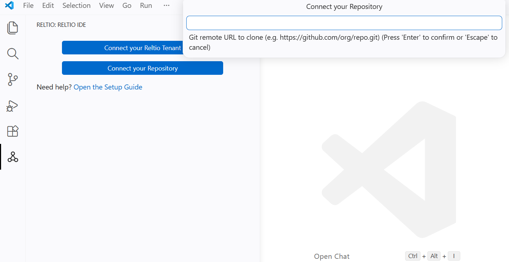
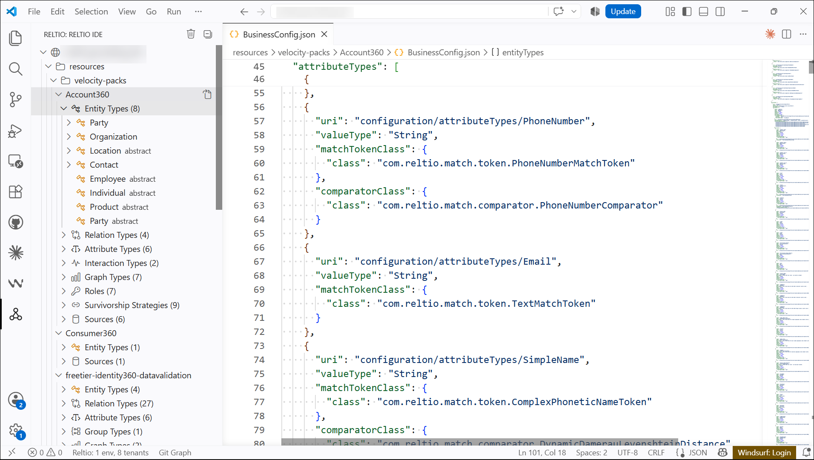
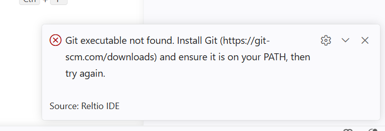
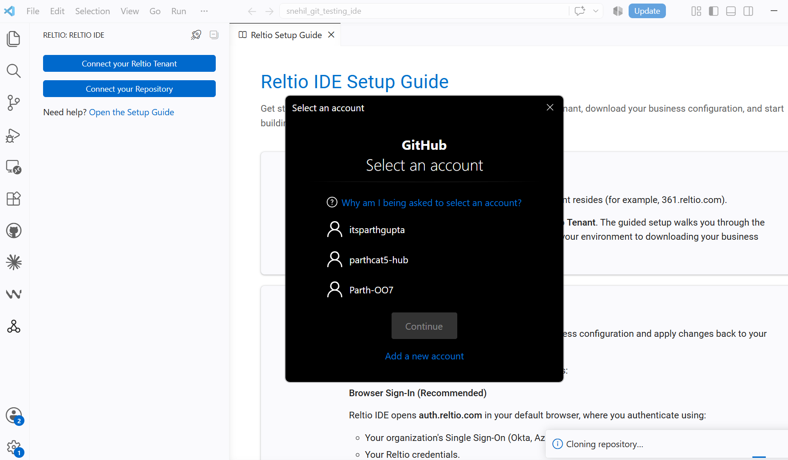

# Quickstart — How to Use Reltio IDE

This guide gets you from install to an open configuration in VS Code or Cursor. Use a **tenant** (steps 3–5) or a **git repository** ([alternative below](#alternative-to-steps-3-5-connect-a-git-repository)). For product context, install screenshots, and the full Git setup (including private repositories), see [README.md](README.md).

---

## Prerequisites

- **VS Code** (1.85+) or **Cursor**
- **Node.js 18+** and **npm** (only if building from source)
- A Reltio environment host, plus either an **OAuth Client ID and Client secret** (with your SSO routing tenant ID) or a valid **Bearer token**
- Or, to edit a configuration straight from version control, a working `git` installation on your `PATH` and no Reltio credentials at all (see [Connect a Git Repository](#alternative-to-steps-3-5-connect-a-git-repository))

---

## 1. Install the Extension

### From a pre-built VSIX

1. Obtain the `.vsix` file from the releases list (or build it — see below).
2. Open VS Code/Cursor → Extensions sidebar (`Ctrl+Shift+X`) → `...` menu → **Install from VSIX…**
3. Select the file and reload when prompted.

### Build from source

```bash
git clone <repo-url>
cd reltio-ide
npm install
npm run package          # outputs target/reltio-metadata-editor-*.vsix
```

Then install the generated `.vsix` as above, or:

```bash
code --install-extension target/reltio-metadata-editor-0.0.1.vsix
# or
cursor --install-extension target/reltio-metadata-editor-0.0.1.vsix
```

---

## 2. Open the Reltio Sidebar

Click the **Reltio** icon in the Activity Bar (left sidebar). This is your control panel for environments, tenants, and configurations.

> The extension also activates automatically whenever you open a `*.reltio.json` file.

**Choose a path:** connect a **live tenant** (steps 3–5) or skip to a **git repository** ([Connect a Git Repository](#alternative-to-steps-3-5-connect-a-git-repository)). You do not need both.

---

## 3. Connect to an Environment

1. In the Reltio sidebar, click **Add Environment** (or run `Reltio: Add Environment` from the Command Palette).
2. Enter your Reltio host, e.g. `361.reltio.com` — the extension validates the host before creating it.
3. A `.reltio/361.reltio.com.reltio.environment/` directory appears in your workspace.

**Authenticate.** Choose one of two methods.

### Option A: Sign in with Browser (recommended)

One-time setup per environment:

4. Right-click the environment → **Configure OAuth Client…**
5. Provide your **Client ID**, **Client secret**, and **SSO routing tenant ID**. The default routing tenant works for most organizations; change it only if yours runs its own.

Then, to sign in:

6. Right-click the environment → **Login with Browser**.
7. Your default browser opens and you authenticate through single sign-on, exactly as you would for the Reltio web UI.
8. On success the tree refreshes and the environment is ready to use.

> Your Client ID, Client secret, and session are kept in your operating system's secure credential store, never in a plaintext file or in `settings.json`. The extension never sees your username, password, or MFA prompt: those stay inside the browser.

Sessions refresh themselves in the background, so you are not prompted again mid-session, and they are restored automatically the next time you open the workspace. If a session cannot be renewed, you are asked to log in again.

If browser login is unavailable for your tenant (no external identity provider is configured for it), the extension tells you so and points you at the bearer token method below.

To sign in again as a different user, right-click the environment → **Re-Login with Browser**. To change or clear your stored client credentials, use **Reset OAuth Client…**. See [docs/BROWSER_LOGIN.md](docs/BROWSER_LOGIN.md) for the full detail.

### Option B: Paste a Bearer Token

4. Right-click the environment → **Provide Token**.
5. Paste your Bearer token.

> Tokens are stored in memory only and are cleared on restart.

---

## 4. Add a Tenant

1. Right-click the authenticated environment → **Add Tenant**.
2. Choose a tenant from the list fetched from the API.
3. A `{tenantId}.reltio.tenant/` directory is created under the environment.

---

## 5. Fetch the Tenant Configuration (L3)

1. Right-click the tenant → **Get Configuration**.
2. The extension downloads the tenant metadata and saves it as `L3.reltio.json` inside the tenant folder.
3. A `L3.remote-baseline.reltio.json` is also saved alongside it — used later to detect server-side drift before you apply changes.

---

## Alternative to Steps 3-5: Connect a Git Repository

Use this instead of steps 3–5 when the configuration already lives in git. No Reltio host, token, or OAuth credentials are needed. Git must be installed on your PATH. For private-repository sign-in detail, see [README.md](README.md#private-repositories).

1. Open an empty folder, or a folder that already holds your clone.
2. In the Reltio sidebar, select **Connect your Repository**.
3. If the folder is already a clone, Reltio IDE detects it and skips ahead. Otherwise, enter the remote URL (for example `https://github.com/org/repo.git`) and press Enter.

<p align="center">
  
  <br/>
  <em>Screenshot (VS Code): Connect your Repository — paste the remote URL to clone.</em>
</p>

4. Reltio IDE searches up to 10 folder levels for `BusinessConfig.json` files (the name is not case-sensitive) and lists them in the tree.

<p align="center">
  
  <br/>
  <em>Screenshot (VS Code): Connected repository — packs and configurations appear in the RELTIO IDE view.</em>
</p>

Authentication uses Git on your machine and its credential helper — whatever already works for `git clone` works here.

**If Git is not installed**, Reltio IDE stops until you install Git from [https://git-scm.com/downloads](https://git-scm.com/downloads), reopen the editor, and retry:

<p align="center">
  
  <br/>
  <em>Screenshot: Git is not installed — install Git, then retry Connect your Repository.</em>
</p>

**If the repository is private**, complete any sign-in that Git requests.

<p align="center">
  
  <br/>
  <em>Screenshot: Git may prompt you to sign in before cloning a private repository.</em>
</p>

**The tree mirrors your repository's folder layout:**

```
▼ reltio-config                      ← the repository
  ▼ DP
      dp_lif                         ← DP/dp_lif/BusinessConfig.json
      dp_ret                         ← DP/dp_ret/BusinessConfig.json
    BusinessConfig.json              ← at the repository root
```

A folder holding a single config collapses onto that config's row. A folder holding several keeps its own row, with one row per file beneath it.

**Managing configs:**

| Action | Where | What it does |
|---|---|---|
| Add Config | Right-click a `.json` file in the Explorer | Adopts a config that discovery missed, such as `L3.json`. Business configurations only; anything else is refused with an error. |
| Remove Config | Right-click a config row | Drops that one config. The rest of the repository stays connected. |
| Remove Repository | Environment row, or the view title | Clears the connection and deletes the folder contents. |

Everything from Step 6 onward (editing, validation, navigation, the ontology preview) works the same way here. Tenant-only actions such as fetch, apply, and configuration history are hidden, since there is no tenant to talk to. A workspace connects either to a tenant or to a repository, never both.

---

## 6. Edit the Configuration

Open `L3.reltio.json`. The editor comes alive with the following capabilities:

### Validation & Diagnostics

- The file is validated against the Reltio JSON schema automatically.
- Broken or unresolved `configuration/...` URI references are underlined with squiggles.
- Adjust severity via the setting `reltio.unresolvedUriSeverity` (`warning` / `error` / `information` / `hint` / `off`).

### Navigation

| Action | How |
|---|---|
| Go to Definition | `Ctrl+Click` (or `Cmd+Click`) on any `configuration/...` URI |
| Find All References | `Shift+F12` on any URI |
| URI IntelliSense | `Ctrl+Space` inside a string value — suggestions are scoped by property type |

### Configuration Tree

The Reltio sidebar shows the full hierarchy:

```
▼ 361.reltio.com
  ▼ householddemo
    ▼ L3 Configuration
      ▼ Entity Types
          Individual
          Organization
      ▶ Relation Types
    ▶ History
```

Click any tree item to jump to that location in the JSON editor.

### Structural Editing (Right-click the Tree)

Use the context menu on any tree node to make structural changes without touching raw JSON:

| Action | Where to right-click |
|---|---|
| Add Entity Type | Entity Types folder |
| Add Relation Type | Relation Types folder |
| Add Simple / Nested / Reference Attribute | Entity type, relation type, or Attributes folder |
| Add Match Group | An entity type row |
| Add Survivorship Group | An entity type or relation type row |
| Rename | Any named node (updates URI references automatically) |
| Delete | Any node |

All edits are AST-aware — commas, nesting, and whitespace are handled correctly.

---

## 7. Ontology Preview (Graph View)

1. Right-click **Entity Types** or **Relation Types** in the **RELTIO IDE** view and select **Show in Ontology**.
2. An interactive graph opens:
   - **Nodes** = entity types
   - **Edges** = inheritance, relationships, and cross-type references
3. Controls:
   - **Pan** — drag on empty canvas space
   - **Zoom** — scroll wheel
   - **Move nodes** — drag any node; positions are saved to a `*.reltio.layout.json` sidecar file
   - **Click a node** — opens an inspector with attributes and type details
   - **Right-click a node** → **Reveal in Tree** or **Reveal in Editor**

---

## 8. Apply Changes Back to the Tenant

After editing locally:

1. Right-click the tenant → **Apply Configuration to Tenant**.
2. The extension compares your local file against the remote baseline:
   - **No drift** → choose **Yes**, **View changes**, or **Don't apply**.
   - **Remote has changed** → you must **Review changes** before proceeding (**Skip** cancels).
3. **View changes** opens a side-by-side diff of the remote vs your local file. Confirm with **Apply to tenant** or choose **Don't apply**.
4. Confirm → the extension sends a `PUT` to the Reltio API.
5. On success, the remote baseline is updated automatically.

---

## 9. Configuration History

1. Right-click a tenant → **View Configuration History** — downloads the 10 most recent revisions into `{tenant}/history/`.
2. Right-click the **History** folder → **Fetch More Configuration History** to load older revisions.
3. Right-click any snapshot for comparison options:

| Option | What it does |
|---|---|
| Compare with Current L3 | Diffs the snapshot against your live `L3.reltio.json` |
| Compare with Previous Snapshot | Diffs against the next-older revision |
| Select for Compare → Compare Selected | Arbitrary pairwise diff between any two snapshots |

---

## Settings Reference

| Setting | Default | Description |
|---|---|---|
| `reltio.unresolvedUriSeverity` | `warning` | Severity for unresolved `configuration/...` URI references |
| `reltio.autoSaveOnEditorSwitch` | `true` | Auto-saves `*.reltio.json` when you switch editor tabs |
| `reltio.autoSaveOnWindowBlur` | `false` | Auto-saves when the VS Code window loses focus |
| `reltio.defaultEnvironments` | `[]` | Seed `{ host, tenantId, tokenFile? }` — **tokenFile is a path only; never put tokens in settings** |
| `reltio.applyDefaultsOnActivate` | `false` | Apply `defaultEnvironments` once on activation |
| `reltio.fetchL3AfterApplyDefaults` | `false` | After apply, fetch L3 for seeded tenants that have a token (never auto-PUT) |

---

## Seed from workspace settings (token file)

For workspaces that already keep a local OAuth token file (for example Reltio Forge’s `skills/mcp-reltio/token.json`), seed the RoR host/tenant without pasting a bearer:

```json
{
  "reltio.defaultEnvironments": [
    {
      "host": "prod-usg.reltio.com",
      "tenantId": "16KZuUKjWAraGx5",
      "tokenFile": "skills/mcp-reltio/token.json"
    }
  ],
  "reltio.applyDefaultsOnActivate": true,
  "reltio.fetchL3AfterApplyDefaults": true
}
```

Then run **Reltio: Apply default environments**, or rely on apply-on-activate (requires a trusted workspace).

**Security:**
- Settings must only store the **path** to a gitignored token file. Do not put `access_token`, refresh tokens, or OAuth client secrets in `settings.json`.
- Prefer user/local settings for `applyDefaultsOnActivate` / `fetchL3AfterApplyDefaults`. Do **not** commit those flags together with host/`tokenFile` into shared `.vscode/settings.json` — that enables unattended token reads and outbound calls for every teammate who trusts the folder.
- Apply defaults is blocked in untrusted workspaces (Workspace Trust).

---

## Cursor Agent Integration

On activation, the extension syncs skill playbooks and Velocity Pack reference files into `.reltio/reltio-agent/` in your workspace. Cursor Agent uses these to understand Reltio concepts and guide model element creation.

- Force a re-sync: Command Palette → **Reltio: Resync agent assets**
- Team overrides: place custom playbooks in `skills/workspace/` — the extension never overwrites that folder

---

## Workspace Directory Structure

After setup, your workspace will look like this:

```
workspace/
└── .reltio/
    ├── 361.reltio.com.reltio.environment/
    │   └── householddemo.reltio.tenant/
    │       ├── L3.reltio.json                   ← active config you edit
    │       ├── L3.remote-baseline.reltio.json   ← drift detection baseline
    │       └── history/
    │           ├── L3-admin---2026-04-10T....reltio.json
    │           └── ...
    └── reltio-agent/
        ├── skills/default/                  ← synced agent playbooks
        └── velocity-packs/                  ← synced reference JSON
```

Legacy workspaces may still have `{host}.reltio.environment/` at the workspace root; the extension continues to discover those. New environments are created under `.reltio/`.

If you connected a git repository instead, none of this applies: your config files stay exactly where the repository puts them, and you edit them in place. The extension only adds a small tracking file at the repository root, which it also adds to `.gitignore` for you.
