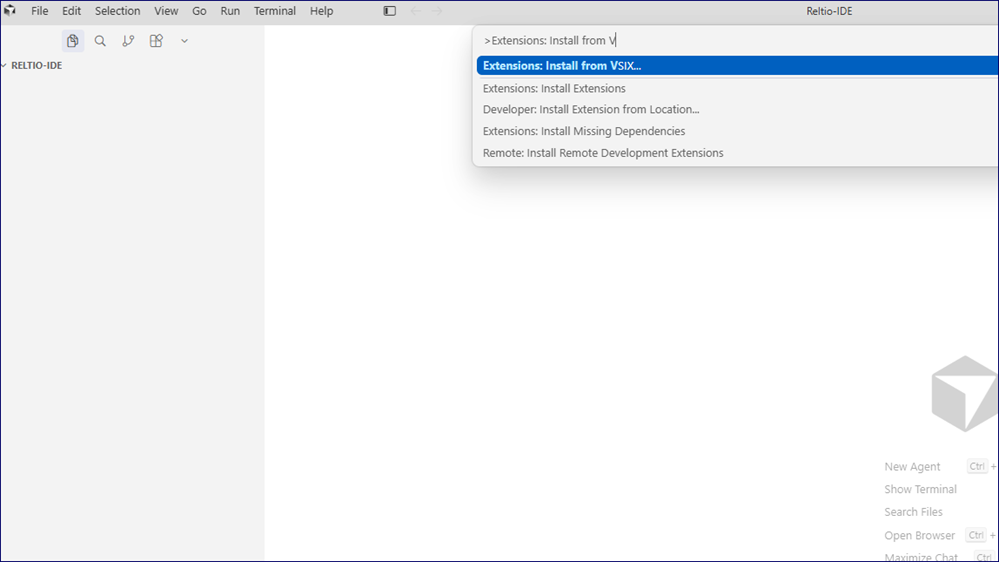
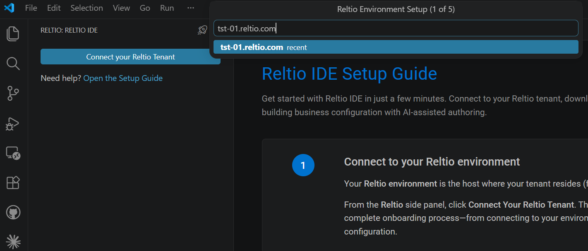
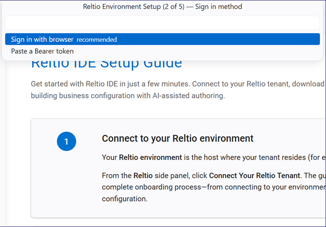
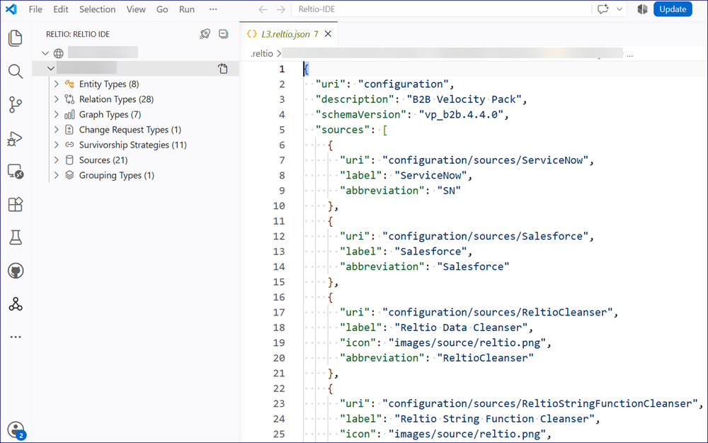
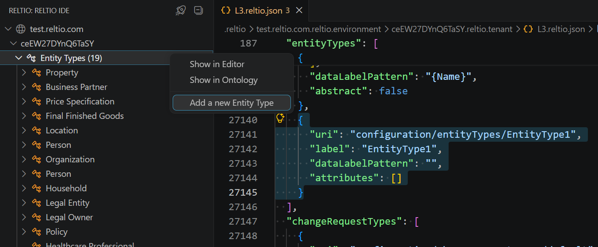
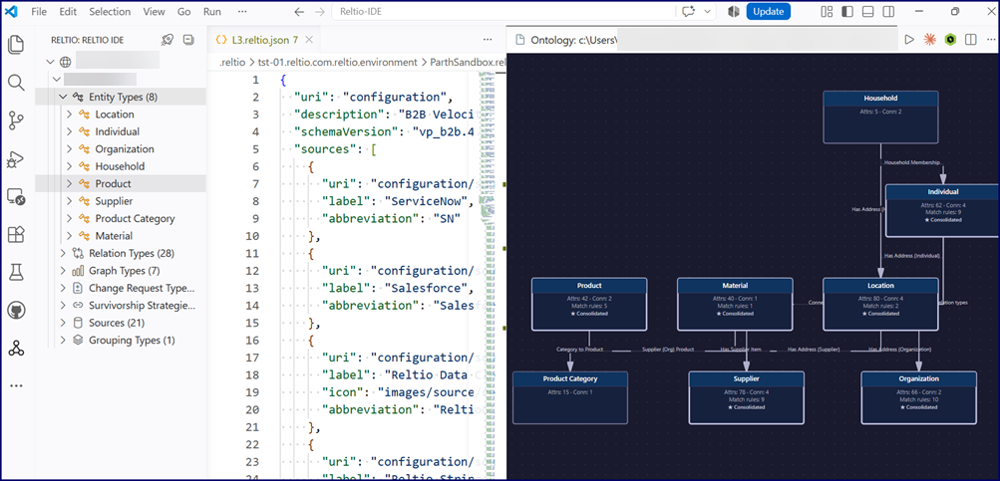

# Reltio IDE

**Model, validate, and deploy your Reltio tenant's business configuration — without leaving VS Code or Cursor.**

---

> **A note on API usage:** Reltio IDE connects to your Reltio environment over the standard Configuration and Platform APIs (for example, when you fetch, apply, or browse configuration history). These calls are counted against the API call entitlements in your SaaS Subscription Agreement with Reltio, the same as any other integration. Typical modeling sessions use a small number of calls, but high-frequency automated use should be scoped with your Reltio account team.

---

## Table of Contents

- [What is Reltio IDE](#what-is-reltio-ide)
- [Why Reltio IDE](#why-reltio-ide)
- [Capabilities](#capabilities)
- [Prerequisites](#prerequisites)
- [Install Reltio IDE](#install-reltio-ide)
  - [Install on Cursor](#install-on-cursor)
  - [Install on VS Code](#install-on-vs-code)
- [Connect to your tenant](#connect-to-your-tenant)
- [Connect a git repository instead](#connect-a-git-repository-instead)
- [Open and navigate your configuration](#open-and-navigate-your-configuration)
- [Create configuration objects](#create-configuration-objects)
- [Visualize the ontology](#visualize-the-ontology)
- [Apply configuration and track changes](#apply-configuration-and-track-changes)
- [Security and credential handling](#security-and-credential-handling)
- [Requirements](#requirements)

---

## What is Reltio IDE

Reltio IDE is an editor extension for building and managing your tenant's business configuration (L3). It brings modeling, validation, and deployment into a single environment inside VS Code or Cursor — with AI-assisted authoring, real-time validation, and a review step before any change reaches your tenant.

Reltio IDE supports the people who design and maintain tenant configuration across data governance, integration, and stewardship roles. If you currently edit `L3` configuration through the Console Data Modeler, hand-edited JSON, or the Intelligent JSON Editor, Reltio IDE is built to replace that workflow with one connected experience.

---

## Why Reltio IDE

Today, editing L3 metadata means moving between three tools, none of which cover the full workflow from creating a type to deploying it safely:

| Existing approach | Limitation |
|---|---|
| **Console Data Modeler** | UI-based, but every change requires navigating multiple screens — slow for iterative modeling. |
| **Direct JSON editing** | No validation, auto-completion, or structural guidance — prone to syntax errors and inconsistent configuration. |
| **Intelligent JSON Editor** | Adds navigation, but doesn't validate against the L3 schema — errors often surface only after you apply to the tenant. |

Reltio IDE replaces all three with one environment for creating, validating, and deploying L3 configuration — in the editor your team already uses for everything else.

---

## Capabilities

| Capability | Description |
|---|---|
| **Tenant connectivity** | Connect securely to your Reltio environment and tenant, and start modeling. |
| **Intelligent navigation** | Browse the complete business configuration and navigate among entity, relation, interaction, hierarchy, and other object types. |
| **AI-assisted authoring** | Create different object types through guided actions or natural-language prompts. |
| **Code completion and validation** | Get context-aware suggestions and real-time validation as you edit metadata, so issues surface before deployment, not after. |
| **Automatic dependency management** | Adding a reference attribute automatically creates the relation type it depends on — no separate setup step. |
| **Ontology visualization** | Visualize your full business configuration as an interactive diagram of entity types and their relationships. |
| **Safe deployment** | Review a side-by-side comparison of your changes before they're applied to your tenant, reducing deployment risk. |
| **Version history** | View configuration history, compare any two versions, and see who changed what and when. |

---

## Prerequisites

Before you install Reltio IDE, make sure you have:

- **VS Code** or **Cursor** installed on your machine.
- The Reltio IDE `.vsix` file — download the latest version from the [Releases](../../releases) page of this repository.
- A Reltio tenant and valid credentials: an **OAuth Client ID and Client secret** (with your SSO routing tenant ID), or a **bearer token**. Not needed if you connect a git repository instead, which requires a working `git` installation on your `PATH`.
- Permissions to read and apply L3 configuration on the tenant.

---

## Install Reltio IDE

Installation differs slightly by editor. Everything from [Connect to your tenant](#connect-to-your-tenant) onward is identical regardless of which editor you use.

### Install on Cursor

1. Open Cursor.
2. Press `Cmd+Shift+P` (macOS) or `Ctrl+Shift+P` (Windows/Linux) to open the Command Palette.
3. Type **Install from VSIX**, then select **Extensions: Install from VSIX...**.
4. Browse to the downloaded `.vsix` file, select it, and click **Install**.
5. Confirm that **Reltio IDE** appears in your installed extensions.

  
   
  <em>Screenshot: Command Palette with "Install from VSIX..." selected.</em>

### Install on VS Code

You can install from VSIX using either of the following:

**Option A — Extensions view**

1. Open VS Code.
2. Select the **Extensions** icon in the activity bar.
3. Select the **...** (More Actions) menu at the top of the Extensions view, then select **Install from VSIX...**.
4. Browse to the downloaded `.vsix` file, select it, and click **Install**.

**Option B — Command Palette**

1. Open VS Code.
2. Press `Cmd+Shift+P` (macOS) or `Ctrl+Shift+P` (Windows/Linux) to open the Command Palette.
3. Type **Install from VSIX**, then select **Extensions: Install from VSIX...**.
4. Browse to the downloaded `.vsix` file, select it, and click **Install**.

Either way, confirm that **Reltio IDE** appears in your installed extensions.

  
   
  <em>Screenshot: Extensions view "..." menu with "Install from VSIX..." selected.</em>

---

## Connect to your tenant

These steps are the same in Cursor and VS Code.

1. Open a folder in your editor. Reltio IDE requires an open folder before you can connect to a tenant.
2. If you're prompted to trust the folder, select **Trust Folder & Continue**. This appears the first time you open the folder.
3. Select the **Reltio** icon in the activity bar to open the **RELTIO IDE** view.
4. Select **Connect your Reltio Tenant** to launch the setup wizard.
5. Enter your environment ID (for example, `test-usg.reltio.com`).

  
   
  <em>Screenshot (VS Code): Setup wizard, step 1 — enter your environment host.</em>

6. Choose an authentication method:
   - **Sign in with browser** (recommended) — enter your Client ID and Client secret, then your SSO routing tenant ID when prompted. Your editor opens a browser to complete single sign-on, and stores these credentials in your operating system's secure credential store.
   - **Paste a Bearer token** — paste your token and press Enter. The token is kept in memory for the current session only.

  
   
  <em>Screenshot (VS Code): Setup wizard, step 2 — choose Sign in with browser or Paste a Bearer token.</em>

7. After authentication, select your tenant from the list. To connect later instead, select **Skip — I'll add a tenant later**.

---

## Connect a git repository instead

If you already keep your business configuration in a git repository (GitHub, Bitbucket, GitLab, Azure DevOps, or self-hosted), you can edit it without connecting to a live tenant.

1. Open an empty folder, or a folder that already contains your cloned repository.
2. Select the **Reltio** icon in the activity bar.
3. Select **Connect your Repository**. If the folder is already a git clone, Reltio IDE detects it and skips straight to discovery. Otherwise, enter the remote URL and it clones for you.
4. Reltio IDE searches the repository for `BusinessConfig.json` files and lists them in the tree as one environment (named after the repository folder) with one entry per config.

Authentication uses your existing system git setup and its credential helper, so no Reltio credentials are involved.

Notes:

- **Multi-config repositories are supported.** A repo holding many `BusinessConfig.json` files appears as a single root node, and the rows beneath it follow the repository's own folder structure. A config at `DP/dp_lif/BusinessConfig.json` shows as **repo → DP → dp_lif**. If one folder holds several configs, that folder keeps its own row and each file appears beneath it.
- **Adopt other filenames** with **Add Config** from a `.json` file's right-click menu in the Explorer. Automatic discovery only looks for `BusinessConfig.json`.
- **Remove Config** drops a single config from the tree. **Remove Repository** clears the connection and deletes the folder contents.
- Tenant-only actions (fetch, apply, configuration history) are hidden in this mode. A workspace is connected either to a tenant or to a repository, never both.

---

## Open and navigate your configuration

1. In the **RELTIO IDE** view, select your tenant.
2. Select the **Open L3** icon beside the tenant ID to open your configuration file, `L3.reltio.json`, in the editor.
3. Expand your tenant to browse its configuration folders — entity types, relation types, attribute types, and other object types, based on your L3 configuration.
4. Right-click your tenant for additional actions: **Copy Tenant ID**, **Apply Configuration to Tenant**, **Fetch Configuration**, **Fetch Configuration History**, and options to add new entity types, relation types, and other object types.

  
   
  <em>Screenshot (VS Code): Connected tenant with its configuration tree expanded, alongside the open L3.reltio.json file.</em>

---

## Create configuration objects

Reltio IDE supports two ways to create configuration objects such as entity types, relation types, and sources.

### Add an object manually

1. In the **RELTIO IDE** view, right-click the object type folder you want to add to — for example, **Entity Types**, **Relation Types**, **Grouping Types**, **Graph Types**, **Sources**, or **Hierarchy Types**.
2. Select **Add a new Entity Type** (or the equivalent action for that folder). The same context menu also offers **Show in Editor** and **Show in Ontology** for existing types.
3. Locate the new object in `L3.reltio.json`. Reltio IDE adds it with a default URI and label, and an empty attributes list.
4. Edit the object to complete its definition — update the label and URI, then add the required attributes and properties.
5. Save `L3.reltio.json` (`Cmd+S` / `Ctrl+S`). Reltio IDE validates your changes and highlights any errors so you can fix them before you apply.

  
   
  <em>Screenshot (VS Code): Entity Types folder context menu with Add a new Entity Type.</em>

### Create an object with AI-assisted authoring

1. Open your editor's AI assistant.
2. Describe the object you want — for example: *"Create an Employee entity type with the relevant attributes and a reference attribute to Organization."*
3. Review the generated configuration. Reltio IDE creates the entity type, adds relevant attributes, adds the reference attribute, and creates the relation type the reference attribute depends on — automatically.
4. Save `L3.reltio.json`.

**Result:** Your new objects appear in the **RELTIO IDE** view under their object type, and their definitions are added to `L3.reltio.json`. For a reference attribute created with AI-assisted authoring, confirm the supporting relation type appears under Relation Types.

---

## Visualize the ontology

The ontology view displays a diagram of your local `L3.reltio.json` configuration — entity types and the relationships between them. It reflects your local file, not the live tenant configuration, and is for visualization only.

1. Open the ontology view using any of the following:
   - Select the **...** (More Actions) menu in the editor toolbar, then select **Reltio: Show Ontology Preview**.
   - Right-click an entity type or relation type in the **RELTIO IDE** view and select **Show in Ontology**.
   - Open the Command Palette, type `ontology`, and select **Reltio: Show Ontology Preview**.
2. Review the diagram. Each entity type appears as a labeled node showing its name, attribute count, connection count, and match rule count. Entity types marked **★ Consolidated** apply match and survivorship rules; entity types marked **Abstract** are base types that other entity types extend and don't hold records directly.
3. Labeled arrows show relation type names, `extends` inheritance connections, and reference attribute connections.
4. To reset the layout, open the Command Palette and run **Reltio: Reset Ontology Layout**.

  
   
  <em>Screenshot (VS Code): Ontology view with entity type nodes (attribute/connection counts, Consolidated markers) and labeled relationship arrows.</em>

---

## Apply configuration and track changes

Reltio IDE supports two configuration management workflows: **Fetch Configuration** syncs your local file with the tenant, and **Apply Configuration to Tenant** deploys your local changes.

### Fetch and apply configuration

1. Right-click your tenant and select **Fetch Configuration** to retrieve the latest configuration from the tenant. Reltio IDE updates your local `L3.reltio.json` once complete.
2. If your local file had unsaved changes when the fetch completed, choose **Keep File** to retain your edits, or **Undo File** to accept the fetched version.
3. Edit `L3.reltio.json` with the changes you want to apply.
4. Right-click your tenant and select **Apply Configuration to Tenant**. Reltio IDE checks whether the remote configuration matches your last fetch and shows a confirmation dialog:
   - **View Changes** — open a diff view and review your changes before applying.
   - **Yes** — apply your local configuration to the tenant immediately.
   - **Don't apply** — cancel the deployment and return to editing.
   - **Cancel** — dismiss the dialog without taking action.

### Review configuration history

1. Right-click your tenant and select **Fetch Configuration History**. A **History** section lists past versions by timestamp and the user who made each change.
2. Right-click your tenant and select **Fetch More Configuration History** to load older entries.
3. Select a history entry to open that version of the configuration.
4. Compare versions:
   - **Compare with Current L3** — compares a snapshot against your current local configuration.
   - **Compare with Previous Snapshot** — compares a snapshot against the version before it.
   - **Select for Compare**, then **Compare Selected** on a second snapshot — compares any two versions.

---

## Security and credential handling

- **Browser OAuth (recommended):** your Client ID, Client secret, and session are handled through single sign-on and stored in your operating system's secure credential store — never in a plaintext file.
- **Bearer token:** kept in memory only for the current session and cleared on restart. It is never written to `settings.json` or committed to your workspace.
- Reltio IDE never asks you to place a token, client secret, or password directly in workspace settings.

---

## Requirements

- VS Code or Cursor
- A Reltio tenant and valid credentials (OAuth Client ID/Client secret + SSO routing tenant ID, or a bearer token)
- Permissions to read and apply L3 configuration on the tenant

---

*Copyright © 2026 Reltio, Inc. All rights reserved.*
