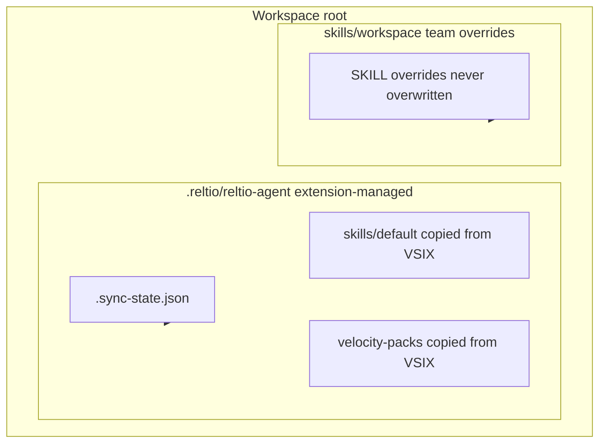

## Context

The Reltio Metadata Editor extension already parses **`*.reltio.json`** into a **`ReltioBusinessModel`**, exposes structural inserts (**entity/relation/attributes/match groups**, etc.), and maintains **`UriIndex`** for navigation. That **deterministic** editor experience (tree, commands, schema validation) remains the **primary** way to work in the IDE.

This feature adds an **optional authoring lane**: **Cursor Agent** (the same agent workflow used to develop this repository) drives **metadata editing** by following **skills**, reading **L3** and **bundled Velocity Pack** files in the workspace, and applying changes through **normal editor means** (edits, existing extension commands)—**not** by embedding an LLM inside the extension. Other external agents that can read the same `SKILL.md` and repo layout are also supported, but **orchestration is out-of-process** from the VS Code extension host.

Separately, Reltio ships **Velocity Packs**: curated configuration patterns per industry, maintained in **Bitbucket** by another team. Product asks that authors grounding **semantics** (“add a Person-like concept”, “connect to existing Organization”) use **realistic patterns**, not only empty skeleton JSON.

This design defines **where skills live**, **how workspaces extend them**, how **bundled Velocity Pack excerpts** become the **primary suggestion corpus**, and how **guided model-element workflows** read in requirements—without prescribing VS Code extension APIs beyond packaging static assets.

## Goals / Non-Goals

**Goals:**

- Establish **clear directory conventions** for **default** (repo-shipped) agent skills vs **workspace-local** skills that tailor behavior per customer repo.
- Specify **bundled Velocity Pack** artifacts as a **versioned, query-oriented reference library** embedded in the extension **for the first milestone** (simple deployment, no runtime Bitbucket dependency).
- Describe **skill families by model element** (entity type, relation type, attributes, match groups) so **Cursor Agent** picks focused playbooks.
- Define **guided-configuration** behavior at the requirements level: interpret user intent, read **current L3 context**, reason about **inheritance** and **relationships**, propose **attributes** aligned with existing naming and with pack-derived idioms.
- Enable **Cursor-driven** metadata authoring as an **add-on** that composes with existing tree commands and inserts—same collaboration model as building features in this repo.

**Non-Goals (initial milestone):**

- Live sync from Bitbucket Velocity Pack repos inside the extension at runtime.
- **Calling any LLM from the extension host.** The extension **SHALL NOT** invoke cloud or local language models. Reasoning and natural-language interpretation stay in **Cursor Agent** (or other external agents using the same skill files and workspace assets).
- Guaranteed schema-perfect JSON on first suggestion—validation remains **diagnostic-driven** as today.
- Replacing the existing **deterministic insert commands**; skills **compose above** them.

## Decisions

### D1 — Default skills live in-repo under a dedicated tree

**Decision:** Ship canonical agent-facing skill documents under:

| Layer | Path (proposal) | Purpose |
|--------|-------------------|---------|
| **Repo defaults** | `skills/reltio-default/` (SKILL.md files grouped by concern, see D2) | Versioned with the extension; reviewed in PRs |
| **Cursor convention** | Optionally mirror or symlink summaries under `.cursor/skills/` for editor discovery | Align with existing Cursor skill UX |

**Rationale:** User asked that defaults **“lay in current project”** and be **distinguishable by model element**. A top-level `skills/` directory is grep-friendly and portable beyond Cursor.

**Alternatives considered:** Skills only under `.cursor/skills` → weaker story for non-Cursor consumers; skills only inside `src/` → blurs runtime vs documentation.

### D2 — Skill naming by model element

**Decision:** Under `skills/reltio-default/`, use **one folder per playbook**, kebab-case:

- `entity-type-concepts/` — inheritance, labels, URIs, consolidation awareness  
- `relation-type-concepts/` — endpoints, direction, cardinality language  
- `attributes-from-concept/` — simple / nested / reference patterns  
- `match-groups-from-concept/` — scope, rules placeholders, alignment with entity semantics  
- `workspace-merge/` — how to combine workspace overrides with defaults (**see D3**)

Each folder contains **`SKILL.md`** following the project’s existing skill format (frontmatter + procedural guidance).

**Rationale:** Cursor Agent routes by **intent + element kind**; splitting avoids monolithic prompts.

### D3 — Workspace extension and precedence

**Decision:** Workspaces MAY define overrides under:

`skills/workspace/` at the **workspace root** (alongside `*.reltio.environment`), OR `.cursor/skills/` workspace overrides as documented in repo README.

**Precedence:** `skills/workspace/**` **overrides** same-relative-path filenames under `skills/reltio-default/**` when both exist; **additive** merge where explicitly documented per skill (e.g., append-only “Examples” sections).

**Rationale:** Enterprise teams need tenant naming and regulatory wording without forking the extension.

**Alternatives:** Single global merge file → poor isolation; env-vars → poor discoverability for agents.

### D3b — Product behavior: versioned skills + Velocity Packs and workspace refresh

This subsection is **normative for the shipped product**, not optional guidance: whenever the extension bundles **default skills** or **Velocity Pack** reference data that is also **materialized into the user workspace** (so Cursor can read paths under the project), the extension **MUST** keep that workspace copy aligned with what the installed VSIX contains. Otherwise users stay on stale instructions after updating the extension.

**Why versions (not only the extension semver):** A new extension build might change **only** skills, **only** pack excerpts, or **only** code. The product therefore carries **two explicit bundle versions** (strings or integers), shipped inside the VSIX, for example in **`reltio-agent-assets.json`** at a known path:

- **`skillsBundleVersion`** — bump whenever any default `SKILL.md` (or bundled skill payload) changes.  
- **`velocityPacksBundleVersion`** — bump whenever `resources/velocity-packs/` manifest or bundled excerpts change.

(Implementers MAY start with both equal to the extension semver for v1 and split later; the requirement is that **skills** and **packs** are independently knowable so refresh can be precise and observable.)

**Where workspace copies live:** Under a single **extension-managed root** (e.g. `.reltio/reltio-agent/`—exact name TBD), with separate subtrees, e.g. `…/skills/default/` and `…/velocity-packs/`. **Team-authored overrides** stay only under `skills/workspace/**` (per D3); the refresh logic **MUST NOT** overwrite that tree.

**How refresh is achieved (mechanism):**

1. **Stamp file** in the workspace, e.g. `.reltio/reltio-agent/.sync-state.json`, recording the last-synced **`skillsBundleVersion`** and **`velocityPacksBundleVersion`** (and optionally the extension package version for support diagnostics).  
2. **On each relevant activation** (e.g. workspace folder open + Reltio view or `*.reltio.json` engagement—exact trigger in tasks): read `reltio-agent-assets.json` from the **installed** extension; compare to `.sync-state.json`.  
3. If **`skillsBundleVersion`** in the VSIX is **newer** than the stamp (or subtree missing): **re-copy** default skills from the extension into `…/skills/default/` only, then update the stamp field for skills.  
4. If **`velocityPacksBundleVersion`** in the VSIX is **newer** than the stamp (or subtree missing): **re-copy** bundled pack files into `…/velocity-packs/` only, then update the stamp field for packs.  
5. **Optional command** “Resync Reltio agent assets” forces a full re-copy of the extension-managed subtrees (still never touching `skills/workspace/**`), for repair after manual deletion.

**If nothing is materialized** (agent reads skills/packs only via `ExtensionContext` paths): there is **no** workspace copy to refresh; new instructions apply as soon as the extension is updated. The version file is still useful for diagnostics and for docs.

**Summary:** This is **part of the product**: versioned bundled assets + compare-on-activation + conditional re-copy into an **extension-managed** workspace subtree + **never** overwrite `skills/workspace/**`.

#### Example: skills + Velocity Packs in the user workspace (materialized)

When bundled assets are **materialized** under the project (so Cursor sees paths under the workspace root), a typical layout looks like this. Names match D3b (`reltio-agent`, `skills/default`, …); adjust only if implementation chooses different spellings.

```text
workspace-root/
├── .reltio/
│   └── reltio-agent/                       # extension-managed — overwritten only by sync
│       ├── .sync-state.json                # last skillsBundleVersion, velocityPacksBundleVersion (+ optional extension semver)
│       ├── skills/
│       │   └── default/                    # copies of bundled default playbooks (from VSIX)
│       │       ├── entity-type-concepts/SKILL.md
│       │       ├── relation-type-concepts/SKILL.md
│       │       ├── attributes-from-concept/SKILL.md
│       │       ├── match-groups-from-concept/SKILL.md
│       │       └── workspace-merge/SKILL.md
│       └── velocity-packs/                 # REQUIRED materialized mirror (D4b); hidden under .reltio
│           ├── manifest.json
│           └── <pack-id>/                  # e.g. life-sciences, insurance
│               └── … excerpt .json fragments …
├── skills/
│   └── workspace/                          # team overrides — NEVER touched by extension sync
│       └── … optional SKILL.md paths that override same logical playbook …
├── <environment>.reltio.environment/
└── … tenants, L3.reltio.json, etc.
```

**Separation of concerns:**

| Path under workspace | Who owns it | On extension upgrade |
|----------------------|-------------|----------------------|
| `.reltio/reltio-agent/**` (except stamp is updated by extension) | Extension sync | Re-copied when `skillsBundleVersion` or `velocityPacksBundleVersion` increases |
| `skills/workspace/**` | Customer / team | Preserved; wins over `…/skills/default/` when paths collide (see D3) |



### D4 — Velocity Packs as bundled reference library

**Decision:** Add **`resources/velocity-packs/`** (or `bundled/velocity-packs/`) containing:

1. **`manifest.json`** — pack id, display name, industry tag, **semver**, optional **provenance** (e.g. upstream revision id or tag **string** when known), file list  
2. **Per-pack excerpts** — **trimmed** JSON or JSON-pointer-addressable fragments (not necessarily full tenant L3), sized for **human and agent search** (reasonable chunks for lookup in-repo)

**Source of content:** Velocity Pack JSON is **committed into this repository** by maintainers when packs are ready to ship (no required automated pull from Bitbucket in v1). Canonical Velocity Pack development may still live elsewhere; this repo **stores** approved excerpts for bundling into the VSIX.

**Rationale:** Keeps the extension self-contained and simple for contributors; manifest still supports traceability when provenance fields are filled.

**Future opportunity:** An optional **offline** script or CI job MAY refresh excerpts from an upstream Bitbucket export—**not** part of the baseline workflow.

### D4b — Velocity Packs: materialize into workspace (hidden, skills-adjacent)

**Decision:** Pack excerpts are **not** only read from the VSIX at runtime. For **Cursor Agent** ergonomics—normal workspace paths (`@`-references, search, indexing, reasonable context chunks)—the extension **SHALL materialize** bundled excerpts into a **workspace-local directory** under the extension-managed root already defined in D3b:

**`.reltio/reltio-agent/velocity-packs/`**

The leading **`.reltio`** segment keeps the tree **hidden** in typical UIs while staying **next to** `.reltio/reltio-agent/skills/default/`. The VSIX **`resources/velocity-packs/`** remains the **canonical** source; sync **copies** into this folder when **`velocityPacksBundleVersion`** advances (same lifecycle as D3b).

**Why not VSIX-only:** Paths inside the installed extension folder are awkward for Cursor’s workspace-relative tooling; materialization fixes discoverability and context-window use without changing the canonical packaging story.

**Lifecycle:** Identical to pack refresh in D3b (stamp file, optional “Resync” command). **Never** write Velocity Pack mirrors under tenant config directories (`*.reltio.tenant/`).

**Size:** Ship **curated excerpts** in-repo only; document a **soft budget** per release (e.g. total MB under `velocity-packs/`) in implementation. If growth threatens UX, split excerpts further or document `@`-glob patterns for agents to narrow reads.

### D5 — Guided model elements: Cursor Agent workflow

**Decision:** This change specifies **skills + reference corpus** for **out-of-process** agents. Skills SHALL instruct **Cursor Agent** to:

1. **Parse** active `L3.reltio.json` (or selection) into **entity/relation inventory** (URIs, labels, `extendsTypeURI`, key attributes).  
2. **Classify** user intent (new type vs extend vs relate).  
3. **Retrieve** relevant pack excerpts from **`.reltio/reltio-agent/velocity-packs/`** (after sync) via manifest paths / search (using normal workspace tools); optional fallback to open bundled files from the extension only if materialization is disabled.  
4. **Emit** structured proposals (tables of URIs, attributes, relation endpoints), then apply edits the same way contributors do today (`WorkspaceEdit`, existing insert commands, or manual JSON edits).

**Optional later (non-AI):** convenience commands such as **“Reveal excerpt in editor”** targeting the **materialized** `.reltio/reltio-agent/velocity-packs/` path (or VSIX path for diagnostics)—purely for UX, **no** model inference in the extension.

**Rationale:** Keeps intelligence in the **agent session** the team already uses to build this project; the extension remains a **carrier** for bundled reference files and standard editing features.

### D6 — Security and licensing of bundled packs

**Decision:** Only bundle packs **explicitly approved** for redistribution inside the VSIX; record license text beside each pack folder. Packs with restricted redistribution remain **document-only** references (link out) until legal clearance.

## Risks / Trade-offs

| Risk | Mitigation |
|------|------------|
| **VSIX size** grows with embedded packs | Ship **curated excerpts** first; full packs optional later or download-on-demand |
| **Stale patterns** vs live Reltio Cloud | Version manifest; refresh when maintainers land updated excerpts (optional automation later) |
| **Conflicting workspace skills** | Document precedence (D3); lint skill names in CI optionally |
| **License** risk on Velocity Pack content | Legal review list + manifest license field |
| **Agent drift** from skill text | Requirements stress **grounding** in current L3 + manifest citations |

## Migration Plan

1. Land **specs + skills folder skeleton** + empty/minimal **`manifest.json`** placeholder.  
2. *(Optional later)* Add automation to refresh pack excerpts from upstream exports.  
3. Incrementally populate **`skills/reltio-default/*`** and **`resources/velocity-packs/`** excerpts as maintainers add approved pack content to the repo.  
4. Update **`ARCHITECTURE.md`** when implementation touches extension packaging.

**Rollback:** Remove bundled directory and skill folders; no schema migration (documentation-only rollback).

## Open Questions

- Exact **minimum excerpt shape** per pack (entity types only vs include sample match groups).  
- **Merge semantics** for partial SKILL.md overrides (line-based vs section-based).

**Resolved:** Velocity Pack placement — excerpts **SHALL** be **materialized** to **`.reltio/reltio-agent/velocity-packs/`** (see **D4b**); lifecycle and version bumps align with **D3b**.
